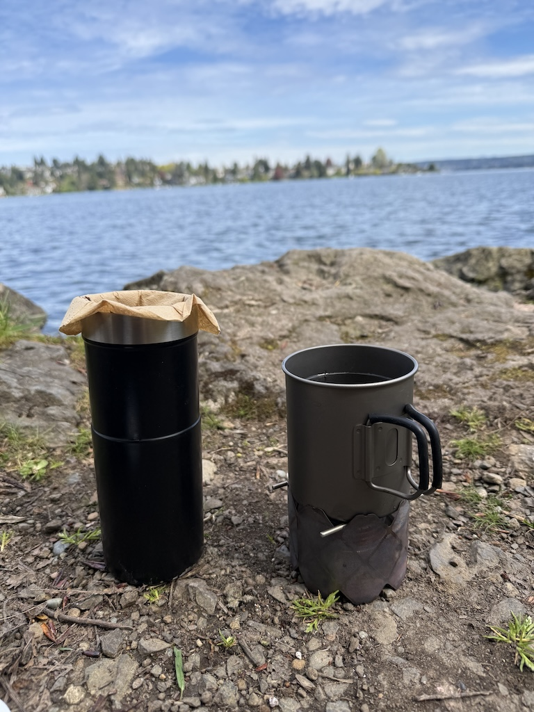
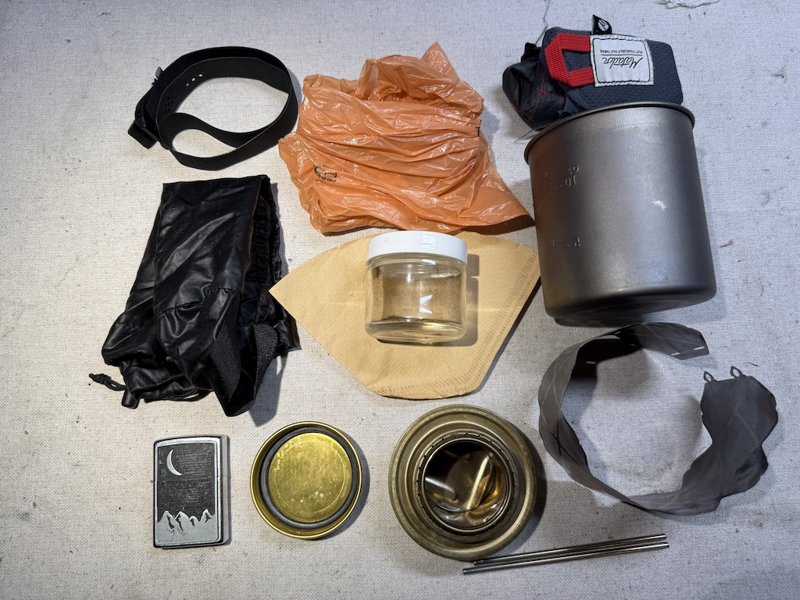
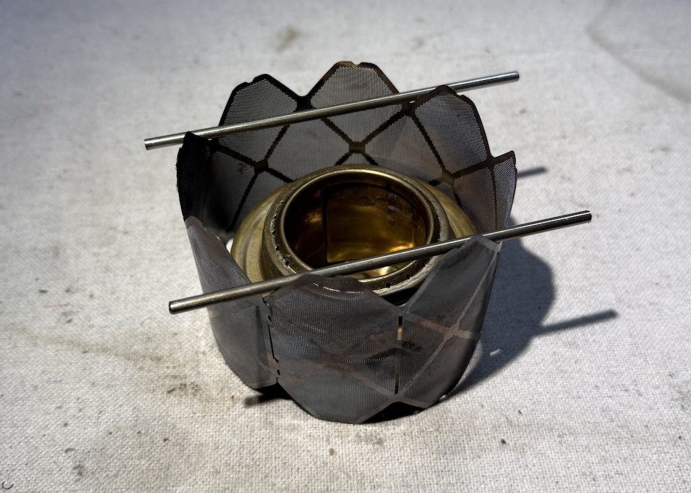
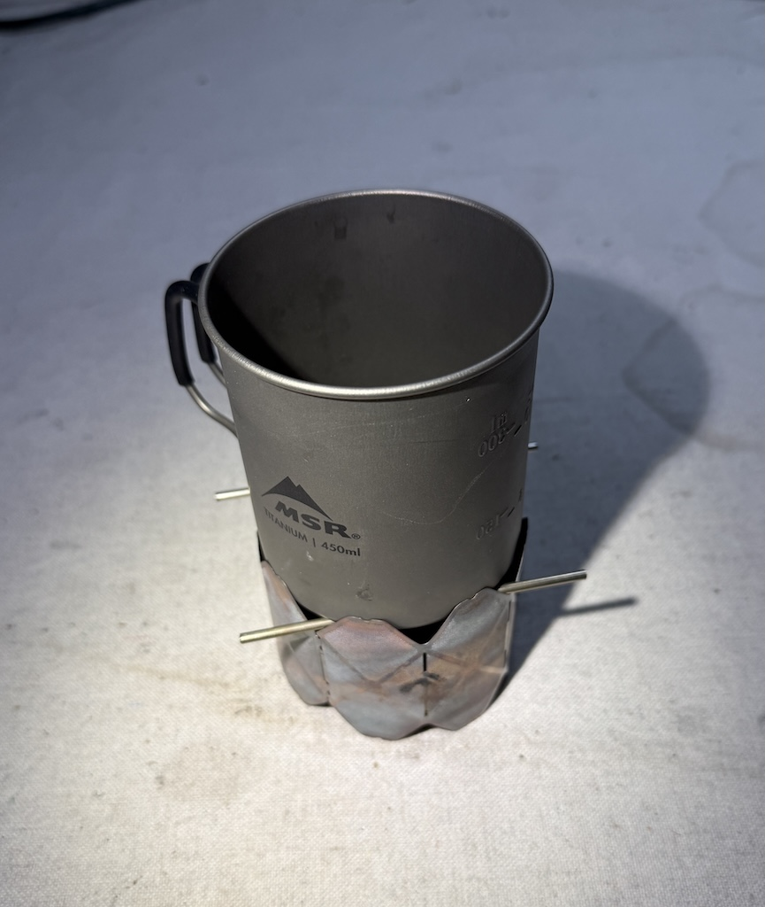
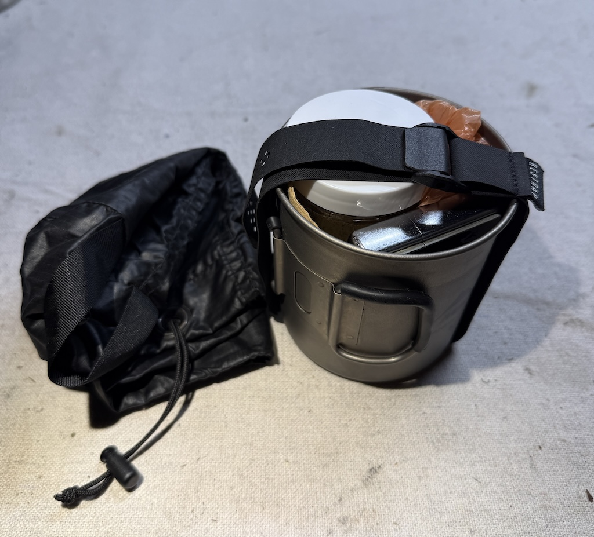
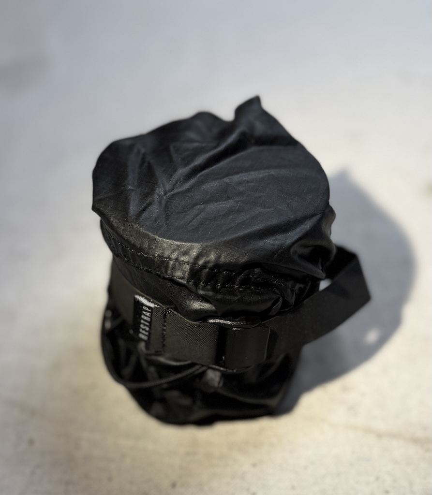

#### Social Coffee

In the summer of 2024 I tried out a regular social gathering to meet cyclists in my community. Every week, year round, folks ride to a rotating park in the early morning to make coffee and friendly conversation. You should look for such a group in your area if you're inclined.

Since then I've seen a variety of different caffeinated beverages and preparations; a common conversation topic is how you do your brew, why you like it, what you could change, etc.

There's a huge spectrum of gear and techniques. Someone makes insant coffee bags in a vintage white gas camp stove from the 1970s. Someone makes espresso from a Bialetti moka pot. Some folks use [cat food stoves](https://zenstoves.net/CatCanStove.htm) or [soda can stoves](https://zenstoves.net/Stoves.htm#:~:text=Open%20Jet%20Alcohol%20Stoves), gooseneck kettles, foldable pour-overs, hand-ground beans weighed on a scale. Some use [isobutane jet stoves](https://zenstoves.net/Canister.htm#:~:text=Propane%2C%20Butane%20and%20Isobutane%20Stoves) kits and an Aeropress. Some roast their beans at home. Some make their coffee [cowboy style](https://www.wikihow.com/Make-Cowboy-Coffee). And once someone lugged full-size home appliances out - electric grider, electric kettle, power supply, ceramic pourover - on their cargo bike.

#### Perfecting my setup

Now I've got my own "park coffee setup". In addition to weekly park meet-ups, it's a ritual to make a cup at the mid-point-ish of my weekend rides.

Since I use it so much, it's something I tweak constantly.  Over time I've tried many of the preparation techniques and gear I discovered from my community, and after quite a few iterations I feel like I've finally reached my end-game setup.

##### Compact coffee service

This is my coffee service in action! The water is heated by a small stove, and I just use a standard coffee filter as a pour-over.

---

###### Contents

- A brass [top-burner alcohol stove](https://zenstoves.net/BasicTopBurner.htm) with sealable lid by Trangia
- A [flexible steel combination wind screen and stand](https://www.amazon.com/windscreen-Ultralight-Stainless-Suitable-Backpacking/dp/B0FLJP516J)
- Repurposed fender stays as supports, sawn to size to fit in my mug
- A Zippo lighter or matches
- A glass container of coffee grounds
- One or two paper coffee filters
- An optional plastic bag for if I can't find a trash can for used grounds, or otherwise make a mess I need to take away
- All stuffed into a 450ml titanium mug/pot
- Within a small ditty bag to keep everything together
- Secured with a small [Restrap fast strap](https://us.restrap.com/collections/luggage-straps/products/fast-straps)

The above does not include some water storage container. If I'm not expecting to have a water bottle or mug that I can pour my coffe into or drink from, I will bring a second 500ml pot, which just fits around the 450ml mug.

---
 

I think it's a great setup for me. It's not super convenient, but for what I use it for, I like that. It forces me to slow down. 

It requires a decent amount of setup and tear-down to pack everything together. The main advantage is that it's tiny. 

It fits it in my back pocket, pretty much any bike bag, rack, or backpack. I can throw it around and it'll be fine since it's mostly sturdy metal. The only thing that will break is the tabs on the wind screen, but it'll still work when it breaks.

---
 

The alcohol burner rests on the ground with the steel windscreen wrapped around it with about 1mm of clearance on all sides. The mug rests a few cm above the burner on the cut-to-size steel fender stays. The stays get blasted and hot, but cool quick enough. The windscreen also gets very hot, but is handleable after a few seconds.

When set up, the mug has nearly zero clearance between it and the wind screen. It kind of slots in, doesn't need pressure to get pushed down so feels pretty safe, but doesn't wiggle at all either.

When I'm finished and wrapping up, I'll either use the strap first around the contents, or second around the ditty bag. I think around the ditty bag works better.

